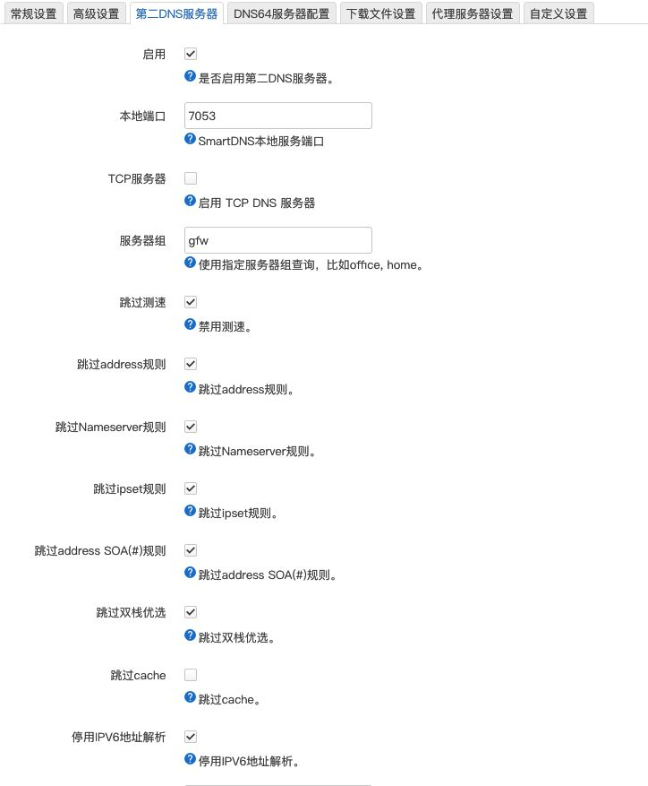
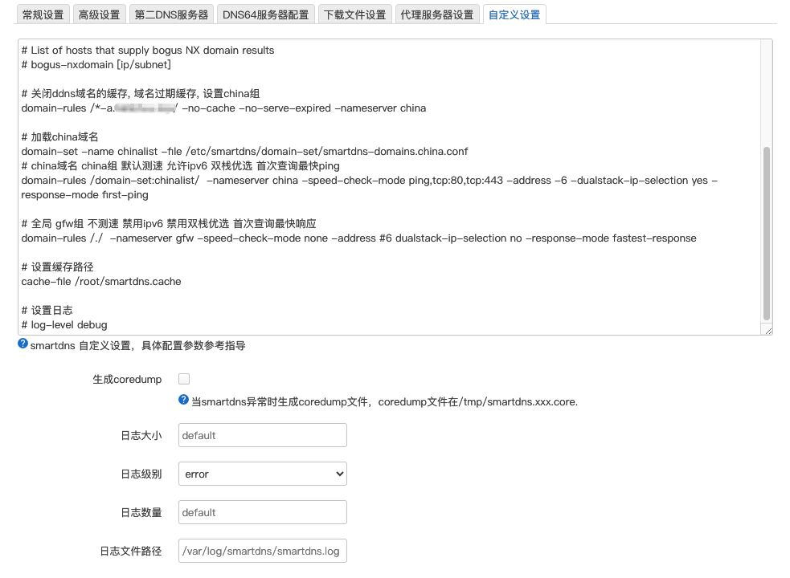

# smartdns-china-domain

适用于 smartdns 的中国网站白名单，内容来自 [felixonmars/dnsmasq-china-list](https://github.com/felixonmars/dnsmasq-china-list)，纯列表，自动更新。

## 使用步骤

1. 添加国内dns服务器, 设置为 `china` 组(都使用udp,且从默认组排除)

```sh
电信    202.96.128.86
电信v6  240e:1f:1::1
腾讯    119.29.29.29
腾讯v6  2402:4e00:
阿里    223.5.5.5
阿里v6  2400:3200::1
百度    180.76.76.76
百度v6  2400:da00:6666
```

2. 添加国外dns服务器, 设置为 `gfw` 组

```sh
OpenDNS       https://208.67.222.222/dns-query
DNS.SB        https://185.222.222.222/dns-query
CloudflareDNS https://1.1.1.1/dns-query
Quad9DNS      https://9.9.9.9:5053/dns-query
```

3. 添加定时任务下载文件 `smartdns-domains.china.conf`到 `/etc/smartdns/domain-set/` 目录下

```sh
#!/bin/sh

# 创建临时目录
tmp_dir="/tmp/smartdns"
mkdir -p "$tmp_dir"

# 检查网络连接
ping -c 1 fastly.jsdelivr.net > /dev/null 2>&1
if [ $? -ne 0 ]; then
  echo "网络连接失败，请检查网络连接。"
  exit 1
fi

# 下载配置文件
wget -O "$tmp_dir/china.conf" https://fastly.jsdelivr.net/gh/jqtmviyu/smartdns-china-domain@main/smartdns-domains.china.conf
if [ $? -ne 0 ]; then
  echo "下载 china.conf 失败。"
  rm -rf "$tmp_dir"
  exit 1
fi

# 移动配置文件并清理临时目录
mv -f "$tmp_dir/china.conf" /etc/smartdns/domain-set/smartdns-domains.china.conf
rm -rf "$tmp_dir"
echo '移动配置文件并清理临时目录'

# 重新加载 smartdns
/etc/init.d/smartdns reload
echo  "重启smartdns"
```

4. SmartDNS 自定义设置

```conf
# 关闭ddns域名的缓存, 域名过期缓存, 设置china组
domain-rules /*-a.example.com/ -no-cache -no-serve-expired -nameserver china

# 加载china域名
domain-set -name chinalist -file /etc/smartdns/domain-set/smartdns-domains.china.conf
# china域名 china组 默认测速 允许ipv6 双栈优选 首次查询最快ping
domain-rules /domain-set:chinalist/  -nameserver china -speed-check-mode ping,tcp:80,tcp:443 -address -6 -dualstack-ip-selection yes -response-mode first-ping

# 全局 gfw组 不测速 禁用ipv6 禁用双栈优选 首次查询最快响应
domain-rules /./  -nameserver gfw -speed-check-mode none -address #6 dualstack-ip-selection no -response-mode fastest-response

# 设置缓存路径
cache-file /root/smartdns.cache
```

## openwrt 路由器设置参考

### 常规设置


### 上游服务器


### 高级设置


### 第二dns服务器



### 自定义设置


