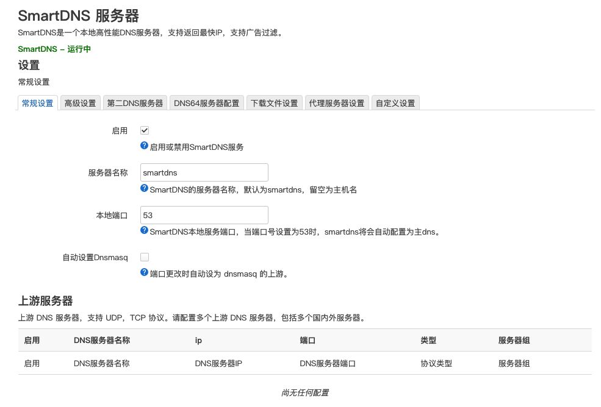
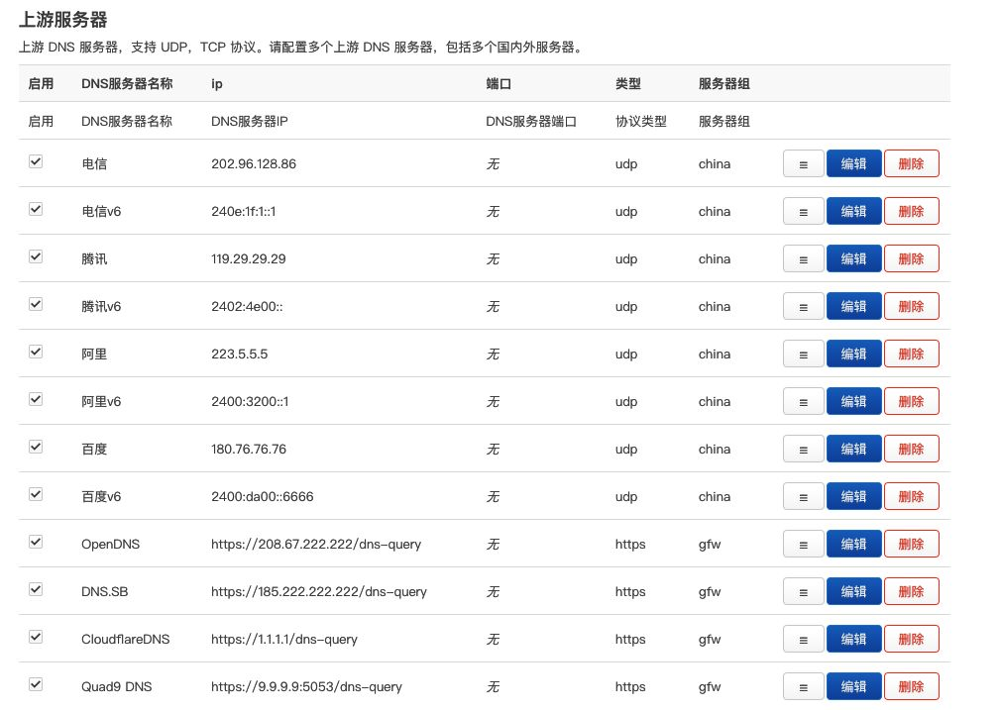
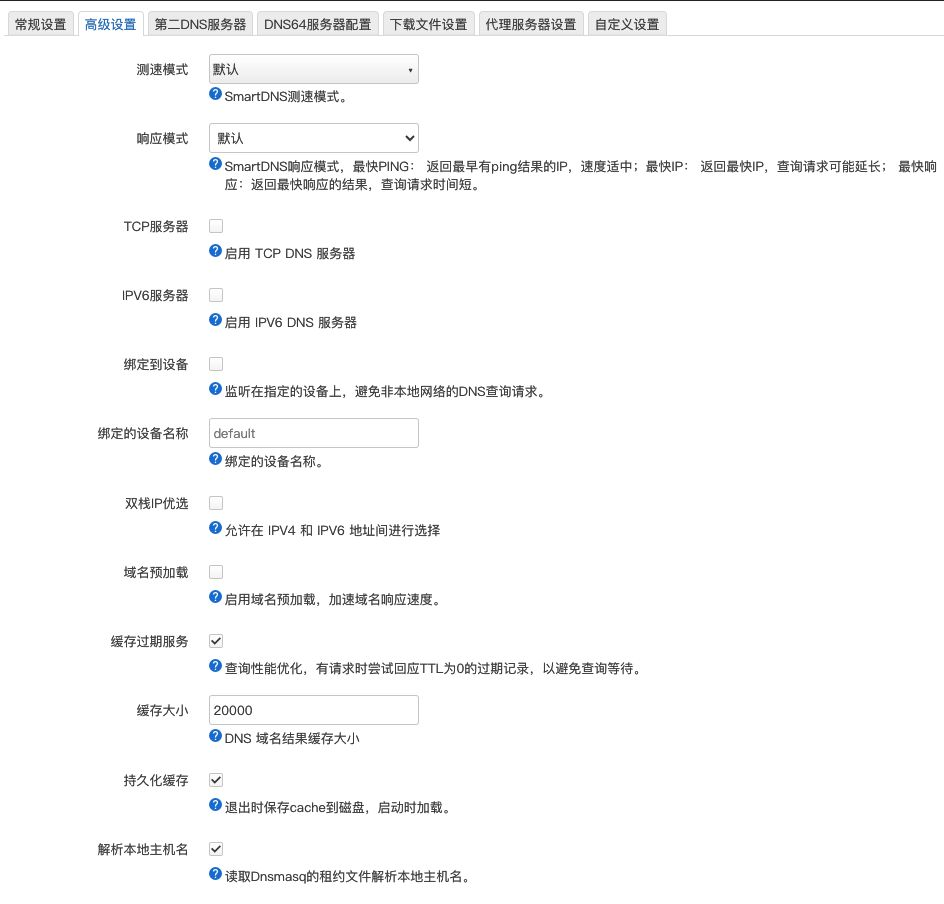
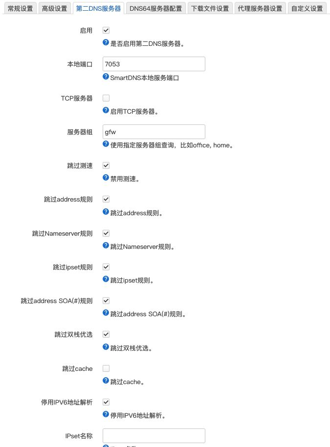

# smartdns-china-domain

适用于 smartdns 的中国网站白名单，内容来自 [felixonmars/dnsmasq-china-list](https://github.com/felixonmars/dnsmasq-china-list)，纯列表，自动更新。

## 使用步骤(白名单模式)

1. 添加定时任务下载文件 `smartdns-domains.china.conf`到 `/etc/smartdns/domain-set/` 目录下

```sh
#!/bin/sh

# 检查网络连接
ping -c 5 ghproxy.net > /dev/null 2>&1
if [ $? -ne 0 ]; then
  echo "网络连接失败，请检查网络连接。"
  exit 1
fi

# 下载配置文件
wget -O "/tmp/china.conf" https://ghproxy.net/https://raw.githubusercontent.com/jqtmviyu/smartdns-china-domain/main/smartdns-domains.china.conf
if [ $? -ne 0 ]; then
  echo "下载 china.conf 失败。"
  exit 1
fi

# 替换配置文件
mv -f /tmp/china.conf /etc/smartdns/domain-set/china.conf
echo '替换配置文件'

# 重新加载 smartdns
/etc/init.d/smartdns reload
echo  "重启smartdns"
```

2. SmartDNS 自定义设置

需要先手动下载 `/etc/smartdns/domain-set/china.conf`,否则自定义设置会报错

```conf
# 缓存持久化文件路径
cache-file	/root/smartdns.cache
# 周期持久化
cache-checkpoint-time 43200

# 广东电信
server 202.96.128.86 -group china  -exclude-default-group
server 240e:1f:1::1 -group china  -exclude-default-group
# 广东联通
server 210.21.196.6 -group china  -exclude-default-group
server 2408:8899::8 -group china  -exclude-default-group
# 广东移动
server 211.136.192.6 -group china  -exclude-default-group
server 2409:8088:: -group china  -exclude-default-group
# 腾讯
server 119.29.29.29 -group china  -exclude-default-group
# 阿里
server 223.5.5.5 -group china  -exclude-default-group
server 2400:3200::1 -group china  -exclude-default-group
# 百度
server 180.76.76.76 -group china  -exclude-default-group

# OpenDNS
server-https https://208.67.222.222/dns-query -group gfw
# DNS.SB
server-https https://185.222.222.222/dns-query -group gfw
# CloudflareDNS
server-tls 1.1.1.1 -host-name 1dot1dot1dot1.cloudflare-dns.com -group gfw
# Quad9DNS
server-https https://9.9.9.9:5053/dns-query -group gfw

# lan地址
address /*-.example.lan/192.168.2.5

# 关闭ddns域名的缓存, 域名过期缓存, 设置china组
domain-rules /*-.example.com/ -no-cache -no-serve-expired -nameserver china

# 加载china域名
domain-set -name china -file /etc/smartdns/domain-set/china.conf
# china域名 china组 默认测速 允许ipv6 双栈优选 首次查询最快ping
domain-rules /domain-set:china/  -nameserver china -speed-check-mode ping,tcp:80,tcp:443 -address -6 -dualstack-ip-selection yes -response-mode first-ping
```

## openwrt 路由器设置参考

### 常规设置



### 高级设置





### 第二dns服务器



### 验证

日志设置`info`

```sh
ping github.com -c 5
cat /tmp/log/smartdns/smartdns.log | grep github.com | grep group
# group是default

ping baidu.com -c 5
cat /tmp/log/smartdns/smartdns.log | grep baidu.com | grep group
# group是china
```